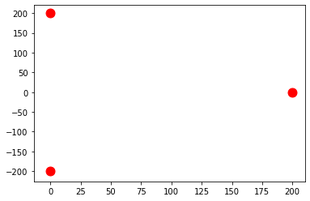
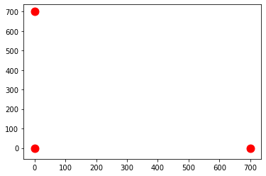

# Test Structure

## Load the test structure (example 1)

### Load custom modules


```python
import os
import sys
sys.path.insert(0, os.path.abspath('../'))

from src.modules.strcture import Structure
```

### Load external modules


```python
import matplotlib.pyplot as plt
import pandas as pd 
```

### Csv file for the structure


```python
pd.read_csv('./structures/example_1.csv') 
```


<div>
<style scoped>
    .dataframe tbody tr th:only-of-type {
        vertical-align: middle;
    }

    .dataframe tbody tr th {
        vertical-align: top;
    }

    .dataframe thead th {
        text-align: right;
    }
</style>
<table border="1" class="dataframe">
  <thead>
    <tr style="text-align: right;">
      <th></th>
      <th>x</th>
      <th>y</th>
      <th>n1</th>
      <th>n2</th>
      <th>n3</th>
      <th>ddl</th>
      <th>Px</th>
      <th>Py</th>
    </tr>
  </thead>
  <tbody>
    <tr>
      <th>0</th>
      <td>0</td>
      <td>200</td>
      <td>0</td>
      <td>1</td>
      <td>1</td>
      <td>0</td>
      <td>0</td>
      <td>0</td>
    </tr>
    <tr>
      <th>1</th>
      <td>200</td>
      <td>0</td>
      <td>1</td>
      <td>0</td>
      <td>1</td>
      <td>3</td>
      <td>0</td>
      <td>-10000</td>
    </tr>
    <tr>
      <th>2</th>
      <td>0</td>
      <td>-200</td>
      <td>1</td>
      <td>1</td>
      <td>0</td>
      <td>2</td>
      <td>0</td>
      <td>0</td>
    </tr>
  </tbody>
</table>
</div>


### Build structure from csv file


```python
structure = Structure.from_csv('./structures/example_1.csv')
```

### Nodes under this structure


```python
structure.nodes
```


    {(0.0, 200.0): <src.modules.node.Node at 0x7f7a4ec4bb20>,
     (200.0, 0.0): <src.modules.node.Node at 0x7f7a4ec4bb50>,
     (0.0, -200.0): <src.modules.node.Node at 0x7f7a4ec4bc40>}


```python
for node in structure.nodes.values():
    plt.scatter([node.x], [node.y], color='r',
                       zorder=2,
                       s=120)
```





### Bars under this structure


```python
structure.bars
```


    {frozenset({0, 1}): <src.modules.bar.Bar at 0x7f7a4ec4bbb0>,
     frozenset({0, 2}): <src.modules.bar.Bar at 0x7f7a4ec4bb80>,
     frozenset({1, 2}): <src.modules.bar.Bar at 0x7f7a4ec4bc70>}


```python
 for bar in structure.bars.values():
    plt.plot([bar.from_x, bar.to_x], [bar.from_y, bar.to_y], color='b', zorder=1)
```


### Visialuzation of the whole structure


```python
structure.draw(show=False)
```


### Calculate the stifness matrix for the bar(1-3)


```python
E = 200000
A = 100
```


```python
structure.bars[frozenset((0, 2))].calculate_k(A, E)
```


    array([[     0.,     -0.,      0.,      0.,     -0.,      0.],
           [    -0.,  50000.,      0.,      0.,      0., -50000.],
           [     0.,      0.,      0.,      0.,      0.,      0.],
           [     0.,      0.,      0.,      0.,      0.,      0.],
           [    -0.,      0.,      0.,      0.,      0.,     -0.],
           [     0., -50000.,      0.,      0.,     -0.,  50000.]])


### Calculate the stifness matrix for the whole structure


```python
k, _, _ = structure.calculate_ll_k_with_forces(A, E)

print(k)
```

    [[ 70710.67811865      0.         -35355.33905933]
     [     0.          70710.67811865 -35355.33905933]
     [-35355.33905933 -35355.33905933  85355.33905933]]


### Unknown displacements for this structure


```python
_, _, unknown_displacements = structure.calculate_ll_k_with_forces(A, E)

for i in unknown_displacements:
    if i % 2 == 0:
        print(f'u{(i // 2) + 1}')
    else:
        print(f'v{(i // 2) + 1}')
```

    u2
    v2
    v3


### Calculate the displacenemts


```python
displacements = structure.calculate_displacements(A, E)

for i, displacement in enumerate(displacements):
    if i % 2 == 0:
        print(f'u{(i // 2) + 1}', '=', displacement, 'mm')
    else:
        print(f'v{(i // 2) + 1}', '=', displacement, 'mm')
```

    u1 = 0.0 mm
    v1 = 0.0 mm
    u2 = -0.05 mm
    v2 = -0.1914213562373095 mm
    u3 = 0.0 mm
    v3 = -0.1 mm


### Calculate deformation Energy


```python
str(structure.calculate_deformation_energy(A, E)) + 'mJ'
```


    '957.1067811865474mJ'


## Load the test structure (example 2)

### Load custom modules

### Csv file for the structure


```python
pd.read_csv('./structures/example_2.csv')
```


<div>
<style scoped>
    .dataframe tbody tr th:only-of-type {
        vertical-align: middle;
    }

    .dataframe tbody tr th {
        vertical-align: top;
    }

    .dataframe thead th {
        text-align: right;
    }
</style>
<table border="1" class="dataframe">
  <thead>
    <tr style="text-align: right;">
      <th></th>
      <th>x</th>
      <th>y</th>
      <th>n1</th>
      <th>n2</th>
      <th>n3</th>
      <th>ddl</th>
      <th>Px</th>
      <th>Py</th>
    </tr>
  </thead>
  <tbody>
    <tr>
      <th>0</th>
      <td>0</td>
      <td>0</td>
      <td>0</td>
      <td>1</td>
      <td>1</td>
      <td>0</td>
      <td>0</td>
      <td>0</td>
    </tr>
    <tr>
      <th>1</th>
      <td>0</td>
      <td>700</td>
      <td>1</td>
      <td>0</td>
      <td>1</td>
      <td>2</td>
      <td>0</td>
      <td>0</td>
    </tr>
    <tr>
      <th>2</th>
      <td>700</td>
      <td>0</td>
      <td>1</td>
      <td>1</td>
      <td>0</td>
      <td>3</td>
      <td>-120000</td>
      <td>-360000</td>
    </tr>
  </tbody>
</table>
</div>


### Build structure from csv file


```python
structure = Structure.from_csv('./structures/example_2.csv')
```

### Nodes under this structure


```python
structure.nodes
```


    {(0.0, 0.0): <src.modules.node.Node at 0x7f7a4a83c400>,
     (0.0, 700.0): <src.modules.node.Node at 0x7f7a4a83c850>,
     (700.0, 0.0): <src.modules.node.Node at 0x7f7a4a83c880>}


```python
for node in structure.nodes.values():
    plt.scatter([node.x], [node.y], color='r',
                       zorder=2,
                       s=120)
```





### Bars under this structure


```python
structure.bars
```


    {frozenset({0, 1}): <src.modules.bar.Bar at 0x7f7a4a83ca90>,
     frozenset({0, 2}): <src.modules.bar.Bar at 0x7f7a4a83cbb0>,
     frozenset({1, 2}): <src.modules.bar.Bar at 0x7f7a4a83cd00>}


```python
 for bar in structure.bars.values():
    plt.plot([bar.from_x, bar.to_x], [bar.from_y, bar.to_y], color='b', zorder=1)
```


### Visialuzation of the whole structure


```python
structure.draw(show=False)
```


### Calculate the stifness matrix for the bar(1-3)


```python
E = 200000
A = 10000
```


```python
structure.bars[frozenset((0, 2))].calculate_k(A, E)
```


    array([[ 2857142.85714286,        0.        ,        0.        ,
                   0.        , -2857142.85714286,       -0.        ],
           [       0.        ,        0.        ,        0.        ,
                   0.        ,       -0.        ,       -0.        ],
           [       0.        ,        0.        ,        0.        ,
                   0.        ,        0.        ,        0.        ],
           [       0.        ,        0.        ,        0.        ,
                   0.        ,        0.        ,        0.        ],
           [-2857142.85714286,       -0.        ,        0.        ,
                   0.        ,  2857142.85714286,        0.        ],
           [      -0.        ,       -0.        ,        0.        ,
                   0.        ,        0.        ,        0.        ]])


### Calculate the stifness matrix for the whole structure


```python
k, _, _ = structure.calculate_ll_k_with_forces(A, E)

print(k)
```

    [[ 3867295.40169507  1010152.54455221 -1010152.54455221]
     [ 1010152.54455221  3867295.40169507 -1010152.54455221]
     [-1010152.54455221 -1010152.54455221  1010152.54455221]]


### Unknown displacements for this structure


```python
_, _, unknown_displacements = structure.calculate_ll_k_with_forces(A, E)

for i in unknown_displacements:
    if i % 2 == 0:
        print(f'u{(i // 2) + 1}')
    else:
        print(f'v{(i // 2) + 1}')
```

    v2
    u3
    v3


### Calculate the displacenemts


```python
displacements = structure.calculate_displacements(A, E)

for i, displacement in enumerate(displacements):
    if i % 2 == 0:
        print(f'u{(i // 2) + 1}', '=', displacement, 'mm')
    else:
        print(f'v{(i // 2) + 1}', '=', displacement, 'mm')
```

    u1 = 0.0 mm
    v1 = 0.0 mm
    u2 = 0.0 mm
    v2 = -0.12599999999999997 mm
    u3 = -0.16800000000000004 mm
    v3 = -0.6503818177180201 mm


### Calculate deformation Energy


```python
str(structure.calculate_deformation_energy(A, E)) + 'mJ'
```


    '127148.72718924363mJ'


## Load a random structure

### Load custom modules

### Csv file for the structure


```python
pd.read_csv('./structures/data.csv')
```


<div>
<style scoped>
    .dataframe tbody tr th:only-of-type {
        vertical-align: middle;
    }

    .dataframe tbody tr th {
        vertical-align: top;
    }

    .dataframe thead th {
        text-align: right;
    }
</style>
<table border="1" class="dataframe">
  <thead>
    <tr style="text-align: right;">
      <th></th>
      <th>x</th>
      <th>y</th>
      <th>n1</th>
      <th>n2</th>
      <th>n3</th>
      <th>n4</th>
      <th>n5</th>
      <th>n6</th>
      <th>ddl</th>
      <th>Px</th>
      <th>Py</th>
    </tr>
  </thead>
  <tbody>
    <tr>
      <th>0</th>
      <td>0.0</td>
      <td>0.0</td>
      <td>0</td>
      <td>1</td>
      <td>0</td>
      <td>1</td>
      <td>1</td>
      <td>1</td>
      <td>3</td>
      <td>0</td>
      <td>0</td>
    </tr>
    <tr>
      <th>1</th>
      <td>0.5</td>
      <td>0.0</td>
      <td>1</td>
      <td>0</td>
      <td>1</td>
      <td>1</td>
      <td>1</td>
      <td>1</td>
      <td>0</td>
      <td>0</td>
      <td>-2000</td>
    </tr>
    <tr>
      <th>2</th>
      <td>1.0</td>
      <td>0.0</td>
      <td>0</td>
      <td>1</td>
      <td>0</td>
      <td>1</td>
      <td>1</td>
      <td>1</td>
      <td>3</td>
      <td>0</td>
      <td>0</td>
    </tr>
    <tr>
      <th>3</th>
      <td>1.0</td>
      <td>0.5</td>
      <td>1</td>
      <td>1</td>
      <td>1</td>
      <td>0</td>
      <td>1</td>
      <td>0</td>
      <td>0</td>
      <td>0</td>
      <td>0</td>
    </tr>
    <tr>
      <th>4</th>
      <td>0.5</td>
      <td>0.5</td>
      <td>1</td>
      <td>1</td>
      <td>1</td>
      <td>1</td>
      <td>0</td>
      <td>1</td>
      <td>0</td>
      <td>0</td>
      <td>0</td>
    </tr>
    <tr>
      <th>5</th>
      <td>0.0</td>
      <td>0.5</td>
      <td>1</td>
      <td>1</td>
      <td>1</td>
      <td>0</td>
      <td>1</td>
      <td>0</td>
      <td>0</td>
      <td>0</td>
      <td>0</td>
    </tr>
  </tbody>
</table>
</div>


### Build structure from csv file


```python
structure = Structure.from_csv('./structures/data.csv')
```

### Nodes under this structure


```python
structure.nodes
```


    {(0.0, 0.0): <src.modules.node.Node at 0x7f7a4a6f89d0>,
     (0.5, 0.0): <src.modules.node.Node at 0x7f7a4a6f8c10>,
     (1.0, 0.0): <src.modules.node.Node at 0x7f7a4a6f84f0>,
     (1.0, 0.5): <src.modules.node.Node at 0x7f7a4a6f86a0>,
     (0.5, 0.5): <src.modules.node.Node at 0x7f7a4a835940>,
     (0.0, 0.5): <src.modules.node.Node at 0x7f7a4a835c10>}


```python
for node in structure.nodes.values():
    plt.scatter([node.x], [node.y], color='r',
                       zorder=2,
                       s=120)
```


### Bars under this structure


```python
structure.bars
```


    {frozenset({0, 1}): <src.modules.bar.Bar at 0x7f7a4a6f8ee0>,
     frozenset({0, 3}): <src.modules.bar.Bar at 0x7f7a4a6f83d0>,
     frozenset({0, 4}): <src.modules.bar.Bar at 0x7f7a4a6f8a00>,
     frozenset({0, 5}): <src.modules.bar.Bar at 0x7f7a4a6f8400>,
     frozenset({1, 2}): <src.modules.bar.Bar at 0x7f7a4a6f8a30>,
     frozenset({1, 3}): <src.modules.bar.Bar at 0x7f7a4a6f8550>,
     frozenset({1, 4}): <src.modules.bar.Bar at 0x7f7a4a6f88b0>,
     frozenset({1, 5}): <src.modules.bar.Bar at 0x7f7a4a6f8430>,
     frozenset({2, 3}): <src.modules.bar.Bar at 0x7f7a4c99c3a0>,
     frozenset({2, 4}): <src.modules.bar.Bar at 0x7f7a4c99cb50>,
     frozenset({2, 5}): <src.modules.bar.Bar at 0x7f7a4a835fd0>,
     frozenset({3, 4}): <src.modules.bar.Bar at 0x7f7a4a835910>,
     frozenset({4, 5}): <src.modules.bar.Bar at 0x7f7a4ea07310>}


```python
 for bar in structure.bars.values():
    plt.plot([bar.from_x, bar.to_x], [bar.from_y, bar.to_y], color='b', zorder=1)
```


### Visialuzation of the whole structure


```python
structure.draw(show=False)
```


### Calculate the stifness matrix for the bar(1-2)


```python
E = 200000
A = 300
```


```python
structure.bars[frozenset((0, 1))].calculate_k(A, E)
```


    array([[ 1.2e+08,  0.0e+00, -1.2e+08, -0.0e+00,  0.0e+00,  0.0e+00,
             0.0e+00,  0.0e+00,  0.0e+00,  0.0e+00,  0.0e+00,  0.0e+00],
           [ 0.0e+00,  0.0e+00, -0.0e+00, -0.0e+00,  0.0e+00,  0.0e+00,
             0.0e+00,  0.0e+00,  0.0e+00,  0.0e+00,  0.0e+00,  0.0e+00],
           [-1.2e+08, -0.0e+00,  1.2e+08,  0.0e+00,  0.0e+00,  0.0e+00,
             0.0e+00,  0.0e+00,  0.0e+00,  0.0e+00,  0.0e+00,  0.0e+00],
           [-0.0e+00, -0.0e+00,  0.0e+00,  0.0e+00,  0.0e+00,  0.0e+00,
             0.0e+00,  0.0e+00,  0.0e+00,  0.0e+00,  0.0e+00,  0.0e+00],
           [ 0.0e+00,  0.0e+00,  0.0e+00,  0.0e+00,  0.0e+00,  0.0e+00,
             0.0e+00,  0.0e+00,  0.0e+00,  0.0e+00,  0.0e+00,  0.0e+00],
           [ 0.0e+00,  0.0e+00,  0.0e+00,  0.0e+00,  0.0e+00,  0.0e+00,
             0.0e+00,  0.0e+00,  0.0e+00,  0.0e+00,  0.0e+00,  0.0e+00],
           [ 0.0e+00,  0.0e+00,  0.0e+00,  0.0e+00,  0.0e+00,  0.0e+00,
             0.0e+00,  0.0e+00,  0.0e+00,  0.0e+00,  0.0e+00,  0.0e+00],
           [ 0.0e+00,  0.0e+00,  0.0e+00,  0.0e+00,  0.0e+00,  0.0e+00,
             0.0e+00,  0.0e+00,  0.0e+00,  0.0e+00,  0.0e+00,  0.0e+00],
           [ 0.0e+00,  0.0e+00,  0.0e+00,  0.0e+00,  0.0e+00,  0.0e+00,
             0.0e+00,  0.0e+00,  0.0e+00,  0.0e+00,  0.0e+00,  0.0e+00],
           [ 0.0e+00,  0.0e+00,  0.0e+00,  0.0e+00,  0.0e+00,  0.0e+00,
             0.0e+00,  0.0e+00,  0.0e+00,  0.0e+00,  0.0e+00,  0.0e+00],
           [ 0.0e+00,  0.0e+00,  0.0e+00,  0.0e+00,  0.0e+00,  0.0e+00,
             0.0e+00,  0.0e+00,  0.0e+00,  0.0e+00,  0.0e+00,  0.0e+00],
           [ 0.0e+00,  0.0e+00,  0.0e+00,  0.0e+00,  0.0e+00,  0.0e+00,
             0.0e+00,  0.0e+00,  0.0e+00,  0.0e+00,  0.0e+00,  0.0e+00]])


### Calculate the stifness matrix for the whole structure


```python
k, _, _ = structure.calculate_ll_k_with_forces(A, E)

print(k)
```

    [[ 2.05358912e+08  6.38926595e+07  0.00000000e+00  0.00000000e+00]
     [ 6.38926595e+07  1.73159533e+08  0.00000000e+00  0.00000000e+00]
     [ 0.00000000e+00  0.00000000e+00  2.05358912e+08 -6.38926595e+07]
     [ 0.00000000e+00  0.00000000e+00 -6.38926595e+07  1.73159533e+08]]


### Unknown displacements for this structure


```python
_, _, unknown_displacements = structure.calculate_ll_k_with_forces(A, E)

for i in unknown_displacements:
    if i % 2 == 0:
        print(f'u{(i // 2) + 1}')
    else:
        print(f'v{(i // 2) + 1}')
```

    u1
    v1
    u3
    v3


### Calculate the displacenemts


```python
displacements = structure.calculate_displacements(A, E)

for i, displacement in enumerate(displacements):
    if i % 2 == 0:
        print(f'u{(i // 2) + 1}', '=', displacement, 'mm')
    else:
        print(f'v{(i // 2) + 1}', '=', displacement, 'mm')
```

    u1 = 0.0 mm
    v1 = 0.0 mm
    u2 = 0.0 mm
    v2 = 0.0 mm
    u3 = 0.0 mm
    v3 = 0.0 mm
    u4 = 0.0 mm
    v4 = 0.0 mm
    u5 = 0.0 mm
    v5 = 0.0 mm
    u6 = 0.0 mm
    v6 = 0.0 mm


### Calculate deformation Energy


```python
str(structure.calculate_deformation_energy(A, E)) + 'mJ'
```


    '0.0mJ'


# Genetic Algorithm

### Apply genetic algorithm to minimize the Edef for example 1


```python
structure = Structure.from_csv('./structures/example_1.csv')
structure.draw(show=False)
```


### Running the GA against Edef to minimize it


```python
E = 200000
```

#### Define a cost function for our problem


```python
def calculate_energy(x):
    return structure.calculate_deformation_energy(E, x[0])
```

#### Create a GA instance with all the necessary parameters


```python
from src.modules.genetic_algorithm import GeneticAlgorithm

genetic_algorithm = GeneticAlgorithm(
    cost_function=calculate_energy,
    variables_min_range=[0.000000001],
    variables_max_range=[10000],
    max_iterations=100,
    population=50,
    beta=1,
    pc=1,
    gamma=0.1,
    mutation_rate=0.01,
    sigma=0.1
)
```

#### Train the GA


```python
best_solution = genetic_algorithm.run()

print('Best Solution:', best_solution.variables, 'Best Cost:', best_solution.cost)
```

    Best Solution: [10000.] Best Cost: 9.57106781186547


#### Plot the cost over time


```python
plt.plot(genetic_algorithm.cost_history)
plt.xlim(0, genetic_algorithm.max_iterations)
plt.xlabel('Iterations')
plt.ylabel('Best Cost')
plt.title('Genetic Algorithm (GA)')
plt.grid(True)
```


